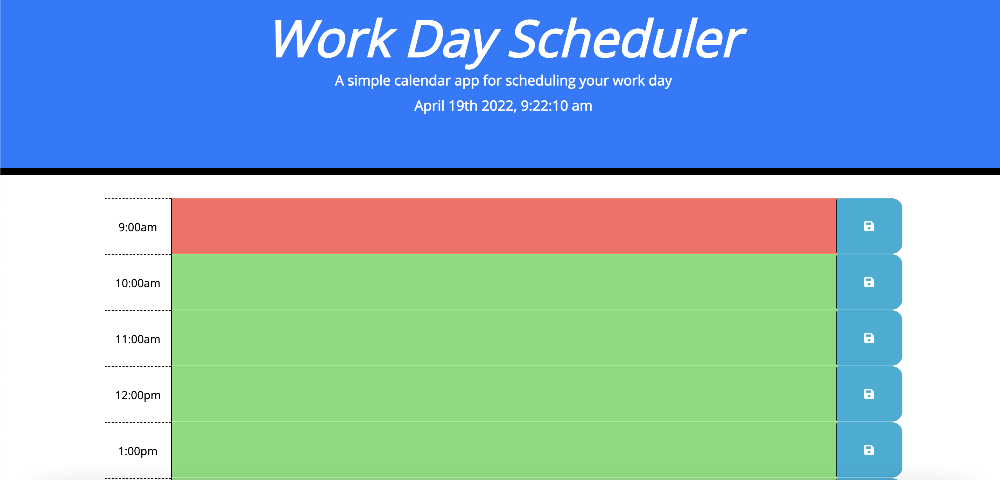

## Third Party APIs: Work Day Scheduler

Time management just got easier with this work day planner. Quickly save events and meetings with the save button which is then saved to Local storage. Check throughout the day to make sure you're time. Old meetings will be grayed out , green will be things to still do and red means a deadline's coming up.

Link to deployed application:  https://alainarosendahl.github.io/05challenge-work-day-scheduler/

Picture of deployed application:
